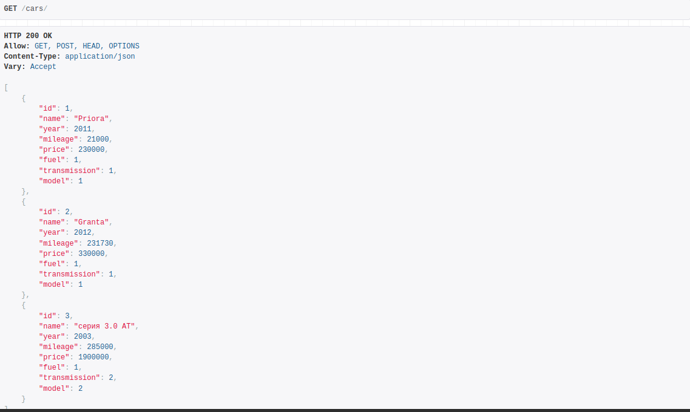
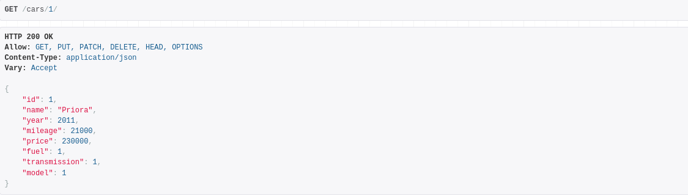
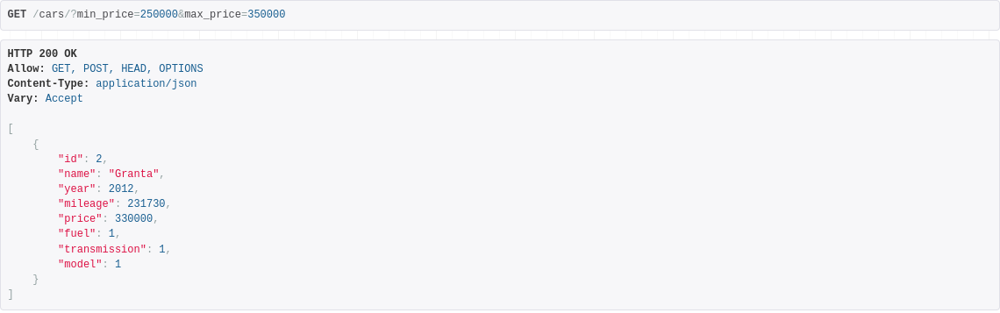
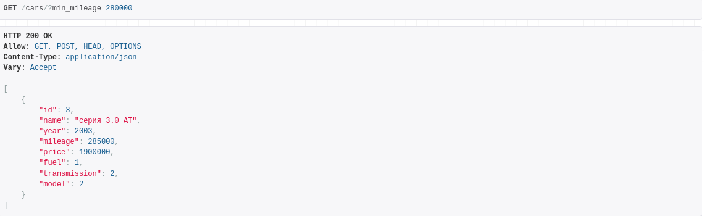

# :bookmark_tabs: Cars

## :pager: Стэк
- **Python**
- **Django**
- **SQLite**

### Тестовое задание: Разработка API для сбора и фильтрации данных об автомобилях

Нажмите, чтобы посмотреть подробности

#### Вам необходимо разработать RESTful API для сбора данных об автомобилях и реализации фильтров по различным параметрам. API должно поддерживать следующие функции:
#### 1. Создайте Django-приложение для управления книгами в библиотеке. Каждая книга должна иметь следующие атрибуты
- Марка
- Модель
- Год выпуска
- Тип топлива (бензин, дизель, электричество, гибрид)
- Тип КПП (механическая, автоматическая, вариатор, робот)
- Пробег
- Цена

#### 2. Получение списка автомобилей с фильтрами:
- По марке
- По модели
- По году выпуска
- По типу топлива
- По типу КПП
- По пробегу (диапазон)
- По цене (диапазон)

#### 3. Получение деталей конкретного автомобиля по ID.
- Имя пользователя
- Электронная почта
- Дата регистрации (автоматически заполняется при создании пользователя)
#### Требования:
- Использовать Python и фреймворк Django или FastAPI.
- Использовать базу данных SQLite или PostgreSQL.
- Реализовать валидацию данных.
- Обеспечить обработку ошибок и возвращение соответствующих HTTP статусов.

## Установка

### 1) Создать и активировать виртуальное окружение
    python -m venv venv 
    source venv/bin/activate - (для Linux и MacOS)
    venv\Scripts\activate.bat - (для Windows)  
### 2) Установить зависимости

    pip install -r requirements.txt

### 3) Выполнить миграции

    python manage.py makemigrations cars
    python manage.py migrate 

### 4) Создать суперпользователя

    python manage.py createsuperuser

## Старт

    python manage.py runserver

## Эндпоинты

### Получение списка автомобилей
- URL: `http://127.0.0.1:8000/cars/`
- Метод: GET
- Описание: Получить список всех авто

### Получение автомобиля по ID.
- URL: `http://127.0.0.1:8000/cars/id`
- Метод: GET
- Описание: Получение деталей конкретного автомобиля по ID.

### Получение автомобиля по диапазону цен (вставить свои)
- URL: `http://127.0.0.1:8000/cars/?min_price=666&max_price=999`

### Получение автомобиля по пробегу (вставить свои)
- URL: `http://127.0.0.1:8000/cars/?min_mileage=666&max_mileage=999`

